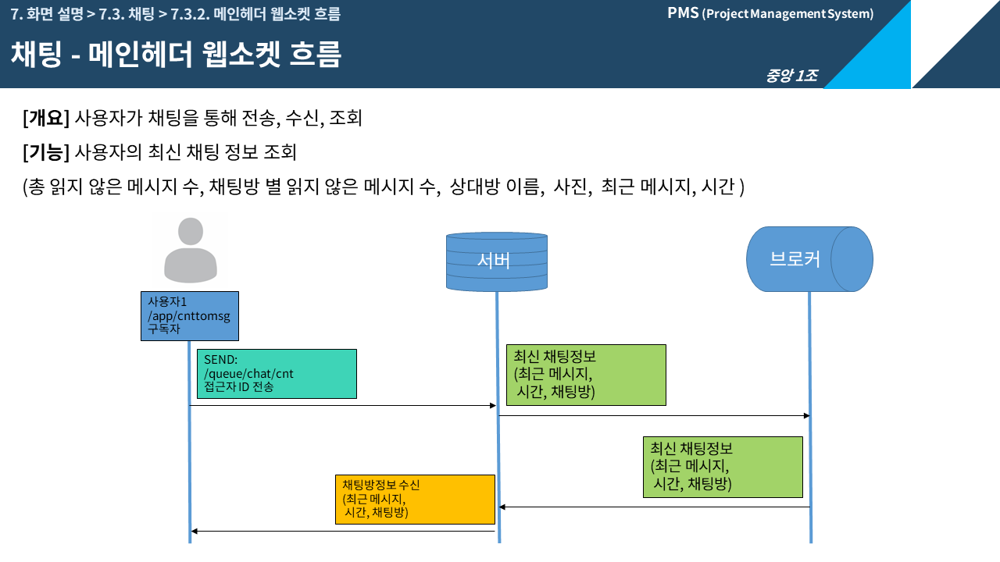
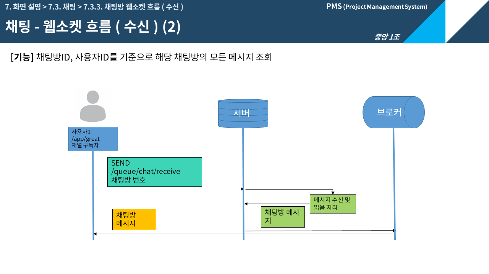

## 📣 중앙인재개발원 1차 프로젝트 - PMS(Project Manager System)

# 📖 프로젝트 개요
##  프로젝트 소개 
#### 교육기관을 모델링하여 다수의 인원을 위한 프로젝트를 관리하는 시스템입니다.  팀장의 프로젝트 생성 후 각 팀원은 작업을 생성하여 각자의 진행 상황을 다양한 방식으로 확인할 수 있으며, 프로젝트를 체계적으로 관리할 수 있습니다.    참고 사이트로는 github와 Notion이 있습니다.
<a href="https://drive.google.com/file/d/1uJAiRvnKQZz13qjMUNyhimV0wr-COuZM/view?usp=drive_link">📌 프로젝트 전체 PPT 보기</a>📌 

### 시스템 프로세스

###  프로젝트 기간
 🕛2023.10.10 - 2023.11.30

### 📚 개발환경

- 
- 
- 
-   
- 

## 프로젝트 팀원 및 역할
👑👩 팀장 황인정 (HIJ) : 프로젝트 생성, 프로젝트 관리, 관리자 페이지, 통합검색

🧑 팀원 이광현 (LKH) : 프로젝트 작업 문서 관리(생성/조회/수정/삭제) 및 다양한 시각화, 휴지통

👩 팀원 이진희 (LJH) : 프로젝트용 캘린더, 알림, 프로젝트 게시판

🧑 팀원 강준우 (KJO) : 채팅(일대일), 관리자 페이지(권한 변경, 반 상태 변경, 게시판 조회,검색), 반 생성

🧑 팀원 문경훈 (MKH) : 회원가입 및 권한 설정

👩 팀원 차예지 (CYJ) : 전체 공지사항/이벤트/Q&A 게시판, 검색기능, To Do List 등록/삭제

👩 팀원 조미혜 (JMH) : 프로젝트 메인, 프로젝트 Home, 프로젝트 게시판, 검색기능

## ERD 

## 🔭 나의 구현 기능

###  ❗ 나의 기능요약정리
---
### 🔥 관리자 접근 🔥 
<!-- 
 -->
>
>> 인터셉터는 URI에 접근할 때 제어하는 용도로 사용됩니다.
>> Spring MVC 요청 순서 : 톰캣(Filter) -> 스프링(Dispatcher Servlet) -> 컨트롤러 -> 뷰

<!-- 
Filter는 웹 애플리케이션의 영역 내에서 필요한 자원들을 활용합니다.
때문에 스프링의 Context를 접근하기는 어렵습니다. 
-->

>
>
> 1. Interceptor는 스프링에서 관리되기 때문에 스프링 내의 모든 객체(빈)에 접근이 가능합니다.
> 2. 빈을 관리하는 스프링 컨테스트 내에 있어서 생성된 빈들에 자유로운 접근이 가능합니다.
> 3. 기존의 구조를 그대로 활용하면서 추가적인 작업이 가능합니다.
>> 현재는 request의 세션에 들어있는 사용자의 정보에서 id를 찾아,
>> 사용자의 ID가 'admin'일 때 관리자페이지를 허용하고, 
>> 아닐 경우 이전의 페이지로 돌아가도록 하였습니다.
---
### 🔥 STOMP 흐름 🔥 
> STOMP(Simple Text Oriented Messaging Protocol)
양방향 네트워크 프로토콜 기반

>> 발신자는 /app을 destination 헤더로 넣어서 메세지를 송신할 수도 있지만, 서버 내에서 가공이나 처리가 필요하다면 /queue로 메세지를 송신하게 되고,
>> /app이라는 경로에 담아 다시 전송하게 되면 이 메세지는 브로커에 의해 최종적으로 /app을 구독하고 있는 구독자들에게 전달하게 됩니다.

> 
>> 채팅방을 켜지 않더라도 채팅에 대한 정보는 필요하기 때문에 매개변수로 사용자의 ID를 전달하여
 사용자가 참여중인 채팅방, 각 채팅방의 읽지 않은 메시지 수, 총 읽지 않은 메시지 수, 최신 메시지, 시간을 받습니다.

> 
>> 채팅방 입장 시 메시지 읽음 처리, 참여중인 채팅방상태를 업데이트합니다.
 만약 상대방과의 채팅방이 존재하지 않는다면, 새로운 채팅방을 만듭니다.
 채팅방의 PK는 시퀀스로 생성되며, 채팅방 생성자ID, 상대방ID 컬럼을 기준으로 만들어집니다.

>  
>> 채팅방 입장 시 채팅방 번호를 요청하여 상대방과의 채팅을 불러오며, 메인 헤더의 읽지 않은 메시지 수, 현재 채팅방의 메시지를 읽음 처리 및 화면에 전달합니다.

>
>> 사용자가 메시지를 전송할 경우, 채팅방의 ID, 메시지, 전송 시간을 전송합니다.

<!--  -->

---
### 🔥 관리자 게시물 관리 🔥 
>
>> 관리자는 학원 내 모든 게시물을 확인할 수 있습니다. 
>> 상단의 게시판은 프로젝트 참가자만 조회가능한 게시판이며, 하단의 게시판은 학원 내 참가자가 조회 가능한 게시판입니다.
>>강의실마다 존재하는 프로젝트별 게시글을 조회 및 삭제가 가능합니다.
>>> 강의실pk와 프로젝트pk를 기준으로하여 게시글을 조회합니다.
>>>관리자는 해당 글에 접근하여 수정, 삭제가 가능합니다.

>
>> 게시글 삭제 시 해당 게시글에 해당하는 좋아요, 댓글들을 삭제합니다.
이 때, 3개 테이블의  게시글이 먼저 삭제되면 데이터 무결성 중 참조 무결성이 깨지기 때문에 
댓글, 추천, 게시글 순으로 삭제됩니다.

---
### 🔥 반 관리 🔥 
>
>> 관리자는 반을 생성할 수 있습니다.
>> 반번호는 100~9999이며, Null값을 입력하면 에러메시지가 출력됩니다.
>> 에러 프로퍼티를 추가하여 Integer타입인 반번호에 다른 타입의 문자를 입력하면 에러메시지를 출력합니다.
>>> 종료날짜가 시작날짜보다 먼저일 경우, BindingResult를 통해 프로퍼티에 등록된 에러메시지를 출력합니다.

>
>> 반 삭제 시 자료 보호를 위해 반 테이블의 삭제여부를 변경합니다.
---
### 🔥 팀장 권한 설정 🔥 
>
> 강의실 내 학생에게 팀장권한을 부여, 제거합니다.
> 팀장인 학생은 체크박스, 일반 학생은 빈박스로 표시됩니다.
>> 학생id(PK)와 권한여부를 List로 받아, 팀장여부를 변경합니다.

        -코드 중 일부-
        for (int i=0; i<user_ids.size(); i++) {
            String user_auth = user_auths.get(i);       //  권한
            String user_id = user_ids.get(i);           //  user PK: id
            if ("manager".equals(user_auth)) {
                user_manager.add(user_id);
            } else user_student.add(user_id);
        }
       

---
## 📌 프로젝트 회고 

  
  

